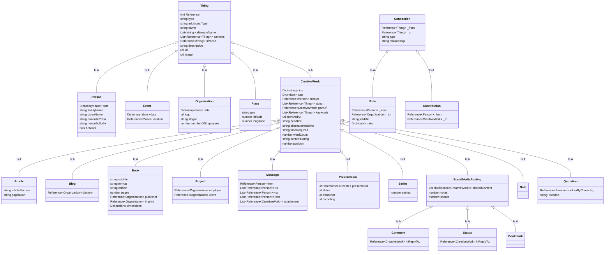

# EatonFYI Data Schema

At a high level, I'm building a big pile of stuff that can cross-link to itself. No good reason, I just like the graphiness of it. Events, people, books and movies, organiations, blogs, places, quotations, and so on each get entries in the graph that can be referred to by an internal URN-like ID — same with my own content.

I've also added a few custom types on top of those to handle my own needs, in some cases redefining Schema.org types..

- CreativeWork/Project (in Schema.org language, this is a kind of organization. For me, it's a CreativeWork optionally for a particular employer / client.)
- CreativeWork/Presentation (A talk/presentation I delivered. Some are just metadata, others will have full slides, transcripts, etc.)
- CreativeWork/Note - For snippets of old journal entries, partial annotations and markups of books I'm reading, post-commentary on other content I've written, etc. Something better probably exists, but for now this is it.
- CreativeWork/SocialMediaPosting/Bookmark - Bookmarks that don't fit in other services.
- CreativeWork/SocialMediaPosting/Comment - General purpose forum and blog post replies.
- CreativeWork/SocialMediaPosting/Status - Twitter, Mastodon, and other microblogging service content.
- Intangible/Connection - Oh look, we've gone and made a triple store  again lol
- Intangible/Role - For tracking person-to-organization relationships like founding, volunteering, employment, etc.
- Intangible/Contribution - For person-to-creativeWork contributions like author/editor/director/actor/etc.

Other types may be added, and "subtypes" for these might be necessary to keep things tidy. Project in particular might require a subtype to describe the kind of thing *that was created* as part of the project. Might also need some kind of thing to represent ephemera. All the other types (Thing, Person, Event, Organization, Place, CreativeWork, Book, etc) are just things that *can be mentioned* in my own posts.

In general, when a page is built for a `Thing`, Notes/Posts/Bookmarks/Articles about it should be listed as if they were the part of the body content of that `Thing`. This allows my scribbles about a book, or a particular topic, or a piece of software, to be splattered across a bunch of discontinuous posts but displayed on a single page.

Tracking intangibles like curated lists, concepts that evolve out of or turn into series or articles, is left as an exercise for later. God knows there's enough meat here to keep me busy for ages.

