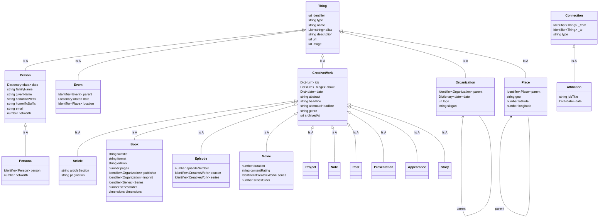

# EatonFYI Data Schema

At a high level, I'm building a big pile of stuff that can cross-link to itself. No good reason, I just like the graphiness of it. Events, People, books and movies, organiations, and so on each get entries in the graph that can be referred to by an internal URN — same with my own content.

My own content consists of a handful of types:

- Project (something I worked on, either for my own purposes or for an employer)
- Appearance (an article, podcast, etc that I appeared on)
- Presentation (A talk/presentation I delivered. Some just be metadata, others will have full slides, transcripts, etc.)
- Reprint (An article I wrote somewhere else, and am)
- Post (A vanilla social media or blog post; might turn this into 'ephemera' or something along those lines)
- Note (A piece of content that annotates, explains, or discusses something else)
- ShortStory (Fiction, there's some of that)
- Media (A video, photo, image post, etc that I created and posted as a distinct entity rather than a support asset for something else)
- Link (A shared link)
- Quotation (A saved quotation)

Other types may be added, and "subtypes" for these might be necessary to keep things tidy. Project in particular might require a subtype to describe the kind of thing *that was created* as part of the project. Might also need some kind of thing to represent ephemera. All the other types (Thing, Person, Event, Organization, Place, CreativeWork, Book, Movie, etc) are just things that *can be mentioned* in my own posts.

In general, when a page is built for a `Thing`, Notes/Posts/Reprints/Links/Media `about` it should be listed as if they were the body of that `Thing`. This allows my scribbles about a book, or a particular topic, or a piece of software, to be splattered across a bunch of discontinuous posts but displayed on a single page.

Related: I want it to be possible to create a *thing* and tag it with potentially interesting topics… then turn the topics into things, if it's merited. Also, I want to be able to move things to and from (fairly) simple Markdown-with-frontmatter files as desired. The Connections between items and other references are an example of that. In several places, properties are described as Identifiers. An `Identifier` can be plaintext, a urn format ID for an item in my graph, or a fully realized `Thing` object. `urn:book:[ISBN]` or `urn:book:[ASIN]` or simply `[Title of Book]` could all be used when referencing a book; When creating Markdown files, entering a plain text name or a URN in frontmatter should be the common case. When filling things out for the eventual 11ty page build, URNs will be replaced by the items they point at.

